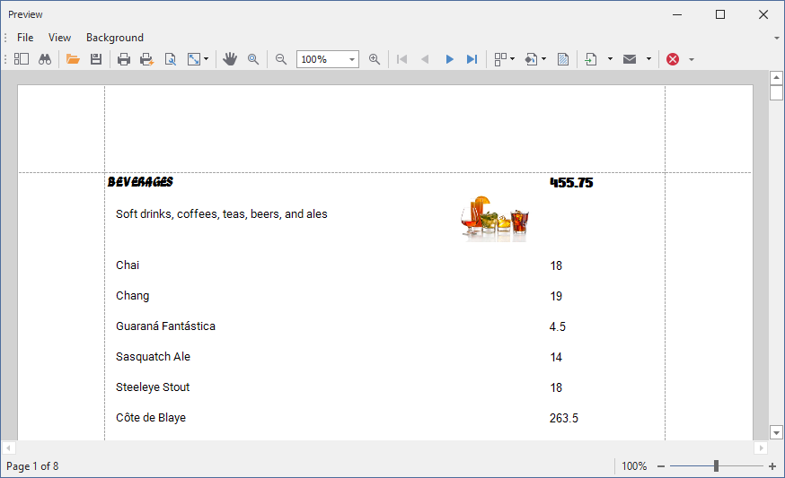

<!-- default badges list -->

<!-- default badges end -->
# Reporting for WinForms - Obtain missing fonts from a font hosting service (Google Fonts)

Your report design and layout may rely on a font type that is not available in the application's hosting environment. The font may not be installed on the client machine, in a Docker image, in an Azure Virtual Desktop, or in another host/container. In such cases, your report substitutes unavailable fonts with default options. Report pages appear different from their original design.  

DevExpress Reports suite helps you ensure that a report uses correct fonts regardless of the hosting environment. A report notifies you about missing typefaces so you can obtain required font data. Once you obtain the fonts, add them to your report's [DXFontRepository](https://docs.devexpress.com/CoreLibraries/404255/devexpress-drawing-library/use-font-repository-to-add-custom-fonts?v=24.2) and thus make them available to report controls. 

You can obtain required font data from any font hosting service. This example illustrates a service that downloads missing fonts from [Google Fonts](https://fonts.google.com). 

> [!Note]
> Review license agreements associated with fonts that you use. Use and redistribution permissions may vary. The service used in this example (Google Fonts) hosts fonts that are open source and without cost. Review [Google Fonts FAQ](https://developers.google.com/fonts/faq) to learn more. 

## Example Details

The report in this example contains a few fonts that may be missing in many hosting environments: _Ga Maamli_, _Roboto_, and _Nerko One_. The example obtains these fonts if missing and make them available to report controls. When exported to PDF, the report uses the original fonts ([result.pdf](result.pdf)):

## Implementation

The [DXFontRepository.QueryNotFoundFont](https://docs.devexpress.com/CoreLibraries/DevExpress.Drawing.DXFontRepository.QueryNotFoundFont?v=24.2) event fires for every unavailable font type. The event handler does the following: 

- Identifies the missing typeface and its suggested alternative (`e.RequestedFont` and `e.ActualFont`) 
- Obtains the required font file from Google Fonts
- Prepares a byte array and passes it to `e.FontFileData`

This implementation ensures that `DXFontRepository` contains all required font types before document generation begins.  

> [!Important]
> Use your personal Google API Key to run this example. For instructions on how to obtain your key, see [Google Fonts Developer API](https://developers.google.com/fonts/docs/developer_api#identifying_your_application_to_google). 
>
> Assign your API Key to the `apiKey` variable in the [FontCollectorService.cs](./CS/LoadMissingFonts/FontCollectorService.cs#L19) file before you launch the example. 

## Files to Review

- [FontCollectorService.cs](./CS/LoadMissingFonts/FontCollectorService.cs)
- [Form1.cs](./CS/LoadMissingFonts/Form1.cs)

## Documentation

- [DXFontRepository.QueryNotFoundFont](https://docs.devexpress.com/CoreLibraries/DevExpress.Drawing.DXFontRepository.QueryNotFoundFont?v=24.2)
- [Use DXFontRepository to Add Custom Fonts](https://docs.devexpress.com/CoreLibraries/404255/devexpress-drawing-library/use-font-repository-to-add-custom-fonts?v=24.2)

<!-- feedback -->
## Does this example address your development requirements/objectives?

 

(you will be redirected to DevExpress.com to submit your response)
<!-- feedback end -->
